# Innovative Feature Fusion and XAI Framework for Robust Tamil Speech Emotion Recognition

[](https://ieeexplore.ieee.org/abstract/document/11570588)
[](LICENSE)
[](https://www.python.org/)
[](https://librosa.org/)
[](https://scikit-learn.org/)
[](https://shap.readthedocs.io/)

> **Official Repository for IEEE ICIRCA 2026 Paper**  
> **Title:** *Innovative Feature Fusion and XAI Framework for Robust Tamil Speech Emotion Recognition*  
> **Authors:** **Gokul Ram K** (First Author), Vignesh U, Shyam Karthinathan P K  
> **Published in:** *2026 7th International Conference on Inventive Research in Computing Applications (ICIRCA)*, pp. 983–989. IEEE.  
> **IEEE Xplore DOI:** [10.1109/ICIRCA11570588](https://ieeexplore.ieee.org/abstract/document/11570588)

---

## 📌 Abstract

Speech Emotion Recognition (SER) in low-resource and Dravidian languages like Tamil presents significant challenges due to acoustic variability, pitch nuances, and limited annotated datasets. This research introduces a robust, **42-dimensional hybrid feature fusion framework** combining timbral/spectral features (**40 Mel-Frequency Cepstral Coefficients - MFCCs**), prosodic features (**Fundamental Pitch Track Mean**), and dynamic intensity features (**Root Mean Square - RMS Energy Mean**). 

We evaluate 8 machine learning algorithms on the benchmark **EmoTa / TamilSER-DB** dataset (936 speech utterances across 209 native Tamil speakers). **Support Vector Machines (SVM with RBF Kernel)** achieved state-of-the-art accuracy of **70.2%** (0.71 Macro F1-score), outperforming tree ensembles and gradient boosting methods. To address black-box model opacity, we integrate a comprehensive **Explainable AI (XAI)** framework featuring **SHAP (SHapley Additive exPlanations)** for global feature attribution across emotional states (*Fear*, *Sad*, *Happy*) and **LIME (Local Interpretable Model-agnostic Explanations)** for local instance-level decision explanations.

> ⚠️ **Dataset Notice**: The EmoTa / TamilSER-DB dataset used for benchmark experiments is an external dataset and is **not owned or redistributed** in this repository. This repository contains the original feature fusion pipeline, training scripts, pre-trained model binaries, XAI explainability engine, and evaluation code developed by the authors. Users can apply this framework to their own audio speech datasets.

---

## 🔥 Key Contributions

1. **Hybrid Acoustic Feature Fusion (42-D)**: Fuses 40 MFCCs with pitch tracking and RMS energy to capture spectral timbre, intonation, and vocal intensity simultaneously.
2. **Benchmark Evaluation of 8 ML Models**: Systematic comparative analysis of SVM, Extra Trees, Random Forest, XGBoost, Gradient Boosting, Logistic Regression, Naive Bayes, and KNN.
3. **Model Interpretability via Dual XAI (SHAP & LIME)**:
   - **Global Explainability (SHAP)**: Identifies key MFCC bands, Pitch, and Energy influence per emotion category.
   - **Local Explainability (LIME)**: Dissects individual audio predictions to explain correct classifications vs. misclassification boundaries (e.g., *Angry* vs. *Neutral*).
4. **Pre-Trained Models & Reproducible Codebase**: Provides full reproducible source code, pre-trained model binaries (`saved_models/`), extraction CLI scripts, and interactive visualization notebooks.

---

## 🏗️ System Architecture

```
                       +-----------------------------------+
                       |    Raw Audio Speech (.wav)        |
                       |    Input Speech Sample / Dataset  |
                       +-----------------+-----------------+
                                         |
                                         v
                       +-----------------+-----------------+
                       |    Feature Extraction Pipeline    |
                       +-----------------+-----------------+
                                         |
       +---------------------------------+---------------------------------+
       |                                 |                                 |
       v                                 v                                 v
+--------------+                 +---------------+                 +---------------+
| 40 MFCCs     |                 | Pitch Track   |                 | RMS Energy    |
| (Timbral)    |                 | Mean (Pitch)  |                 | Mean (RMS)    |
+--------------+                 +---------------+                 +---------------+
       |                                 |                                 |
       +---------------------------------+---------------------------------+
                                         |
                                         v
                       +-----------------+-----------------+
                       | 42-D Hybrid Feature Vector Fusion |
                       +-----------------+-----------------+
                                         |
                                         v
                       +-----------------+-----------------+
                       |    StandardScaler Normalization   |
                       +-----------------+-----------------+
                                         |
                                         v
                       +-----------------+-----------------+
                       |     Machine Learning Models       |
                       |   (SVM, Extra Trees, RF, XGB...)  |
                       +-----------------+-----------------+
                                         |
                        +----------------+----------------+
                        |                                 |
                        v                                 v
         +--------------+--------------+   +--------------+--------------+
         | Emotion Classification      |   | Explainable AI (XAI) Engine |
         | (Angry, Fear, Happy,        |   | - Global SHAP Summaries      |
         |  Neutral, Sad)              |   | - Local LIME Explanations    |
         +-----------------------------+   +-----------------------------+
```

---

## 📊 Dataset Profile & Benchmark Summary

The experimental evaluation was conducted on the **TamilSER-DB** benchmark dataset containing 936 speech samples recorded across **209 unique native Tamil speakers**, spanning 5 distinct emotional states:

| Emotion Class | Count | Unique Speakers | Description |
| :--- | :---: | :---: | :--- |
| **Neutral** | 209 | 209 | Baseline conversational tone |
| **Sad** | 209 | 209 | Subdued vocal pitch & lower energy |
| **Happy** | 209 | 209 | Elevated fundamental pitch & dynamics |
| **Angry** | 199 | 199 | High energy, sharp pitch variation |
| **Fear** | 110 | 110 | High pitch, trembling acoustic profile |
| **Total** | **936** | **209** | **5 Emotion Classes** |

<p align="center">
  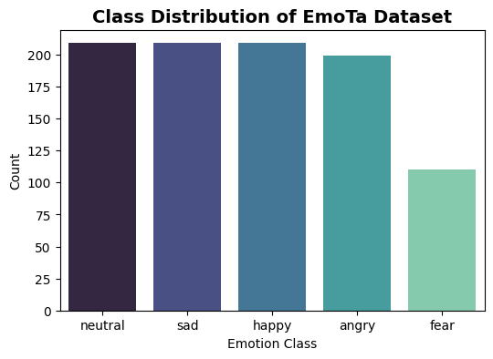
  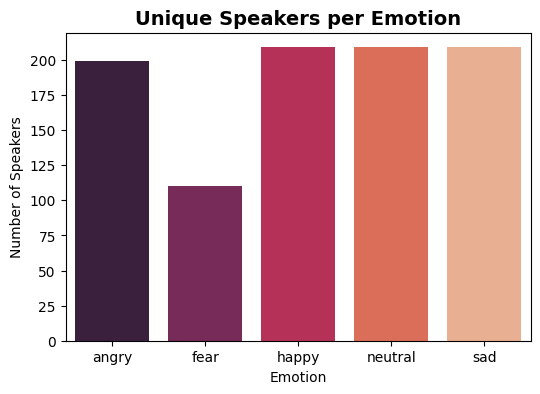
</p>

### Acoustic Waveform & Audio Profile
<p align="center">
  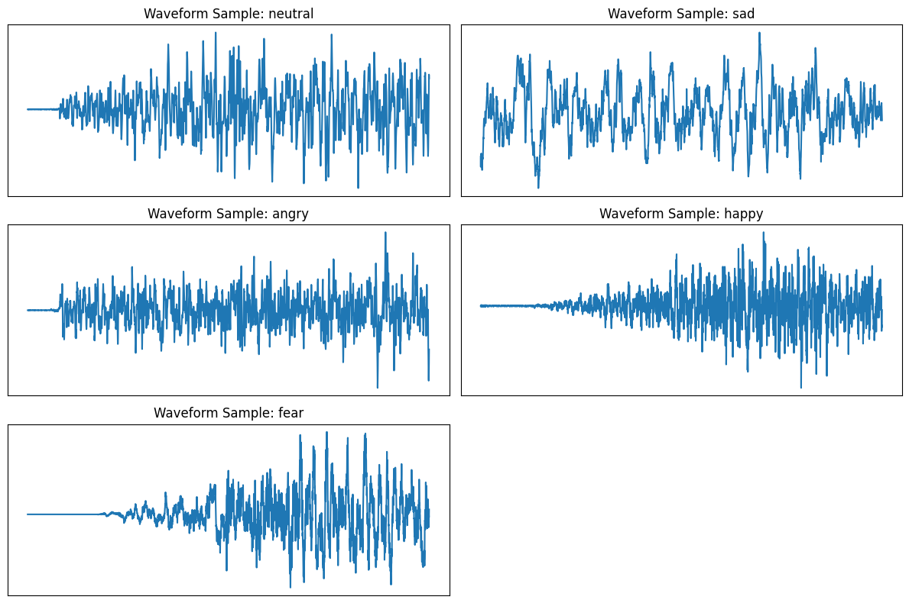
  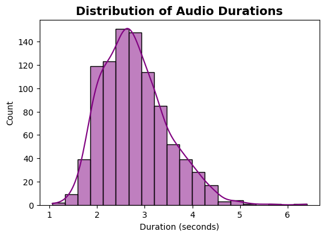
</p>

---

## 📈 Benchmark Experimental Results

All models were evaluated on an **80/20 stratified train-test split** (748 training samples, 188 test samples).

### Model Performance Comparison

| Rank | Model Classifier | Accuracy | Precision | Recall | Macro F1 | Weighted F1 |
| :---: | :--- | :---: | :---: | :---: | :---: | :---: |
| 🥇 | **SVM (RBF Kernel)** | **70.21%** | **0.71** | **0.70** | **0.71** | **0.70** |
| 🥈 | **Extra Trees Classifier** | **69.15%** | **0.70** | **0.70** | **0.70** | **0.69** |
| 🥉 | **Random Forest** | **67.02%** | **0.68** | **0.68** | **0.68** | **0.67** |
| 4 | **XGBoost (Tuned)** | **62.23%** | **0.64** | **0.63** | **0.64** | **0.62** |
| 5 | **Gradient Boosting** | **54.26%** | **0.56** | **0.55** | **0.55** | **0.54** |
| 6 | **Logistic Regression** | **42.02%** | **0.42** | **0.44** | **0.42** | **0.42** |
| 7 | **Naive Bayes (Gaussian)** | **40.43%** | **0.40** | **0.43** | **0.39** | **0.38** |
| 8 | **K-Nearest Neighbors (k=5)**| **31.91%** | **0.33** | **0.34** | **0.32** | **0.31** |

---

### SVM Classification & Confusion Matrices

SVM (RBF kernel, $C=10$, $\gamma=\text{scale}$) achieved peak performance across all emotion categories:

<p align="center">
  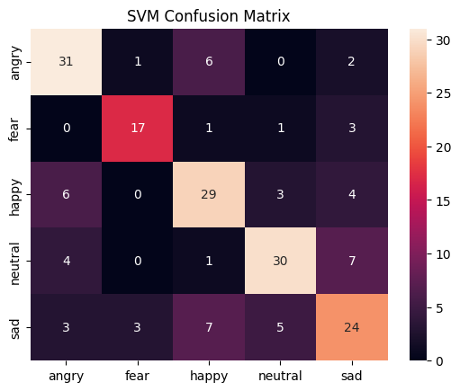
  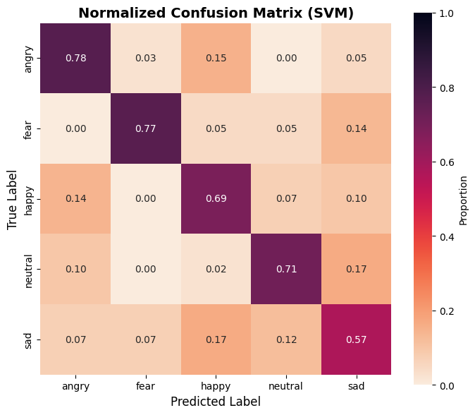
</p>

### ROC & AUC Curve
<p align="center">
  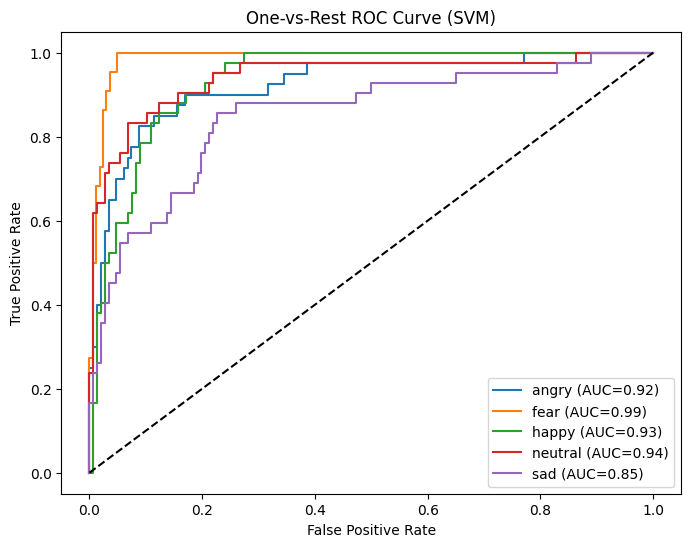
</p>

---

## 🔍 Explainable AI (XAI) Framework

### 1. Global Feature Importance Ranking
Tree-based feature importance analysis confirms that upper MFCC coefficients, fundamental pitch mean, and energy dynamics contribute heavily to emotion differentiation:

<p align="center">
  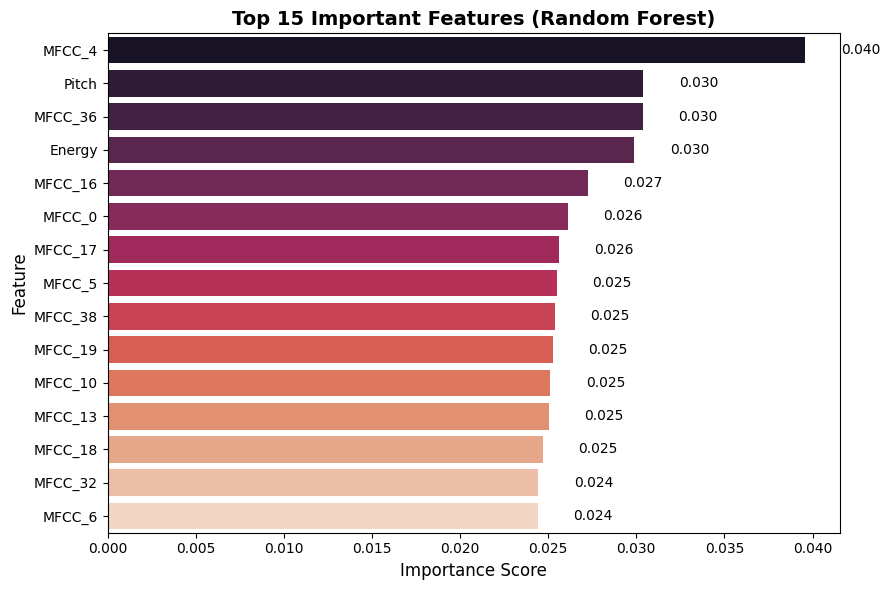
  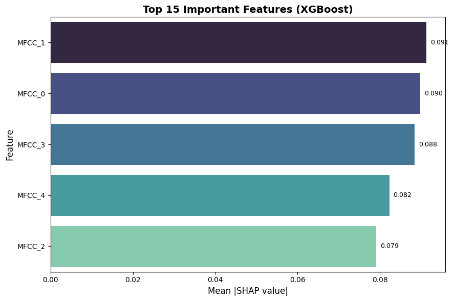
</p>

---

### 2. SHAP (SHapley Additive exPlanations) Summary Plots
Per-class SHAP analysis highlights feature impact directionality across specific emotions:

<p align="center">
  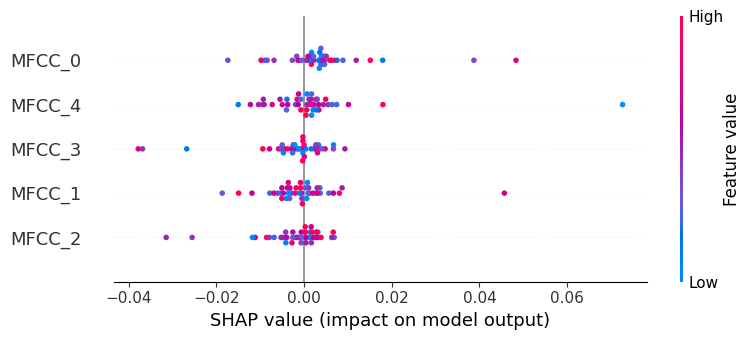
  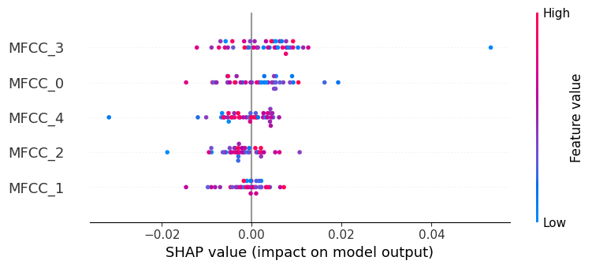
  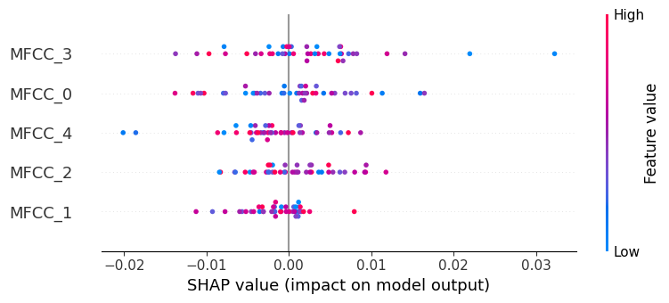
</p>

---

### 3. Local LIME Explanations
LIME explanations decompose single audio predictions to identify which specific acoustic features pushed the decision towards the target emotion:

| Correctly Classified Sample (*Angry*) | Misclassified Sample (*Angry* $\rightarrow$ *Neutral*) |
| :---: | :---: |
| 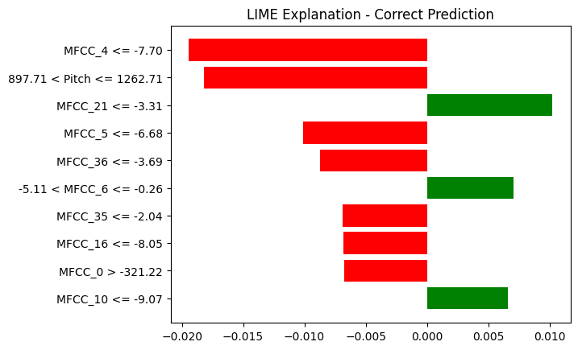 | 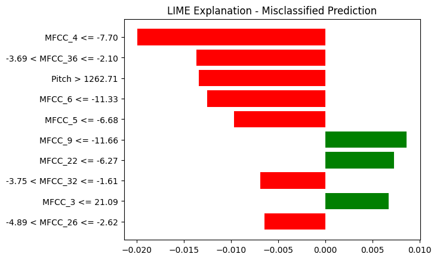 |

---

## 📂 Repository Directory Structure

```
GITHUB Pushes/
├── README.md                          # Main project documentation & paper details
├── LICENSE                            # MIT Open Source License
├── requirements.txt                   # Pinned Python package dependencies
├── .gitignore                         # Git ignore rules for cache & datasets
├── CITATION.cff                       # Citation file format for GitHub
├── bibtex.bib                         # IEEE BibTeX reference
├── images/                            # High-resolution evaluation charts & plots
│   ├── class_distribution.png
│   ├── unique_speakers.png
│   ├── Waveform.png
│   ├── audio_distribution.png
│   ├── cm_svm.png
│   ├── ncm_svm.png
│   ├── roc_svm.png
│   ├── f_i_rf.png
│   ├── f_i_xgb.png
│   ├── shap_fear.png
│   ├── shap_sad.png
│   ├── shap_happy.png
│   ├── lime_correct.png
│   └── lime_misclassified.png
├── saved_models/                      # Pre-trained ML model binaries (.pkl)
│   ├── svm_model_best.pkl
│   ├── extra_trees_model.pkl
│   ├── random_forest_model.pkl
│   ├── xgboost_model.pkl
│   ├── gradient_boosting_model.pkl
│   ├── knn_model.pkl
│   ├── logistic_regression_model.pkl
│   └── naive_bayes_model.pkl
├── scripts/                           # Modular Python executable scripts
│   ├── extract_features.py            # 42D Feature extraction (MFCC + Pitch + Energy)
│   ├── train_eval.py                  # Benchmarking script for 8 ML models
│   └── inference.py                   # Emotion prediction CLI for raw .wav audio
└── notebooks/                         # Cleaned Jupyter Notebooks
    ├── 01_EDA_and_Data_Visualization.ipynb
    └── 02_Feature_Fusion_Training_and_XAI.ipynb
```

---

## 🚀 Quick Start Guide

### 1. Installation & Environment Setup
Clone the repository and install required dependencies:

```bash
git clone https://github.com/GOKULRAM-K/tamil-speech-emotion-recognition-xai.git
cd tamil-speech-emotion-recognition-xai
pip install -r requirements.txt
```

---

### 2. Audio Feature Extraction (42D Hybrid Vector)
Extract 42-D fused acoustic features from a single `.wav` audio file:

```bash
python scripts/extract_features.py --file sample_audio.wav
```

Batch process a dataset CSV:
```bash
python scripts/extract_features.py --csv dataset_metadata.csv --output features.npz
```

---

### 3. Emotion Prediction / Inference CLI
Predict emotion for any speech `.wav` file using the pre-trained SVM model:

```bash
python scripts/inference.py --audio sample_audio.wav
```

**Example Output:**
```
🎙️ Extracting 42D fused acoustic features from: sample_audio.wav

==================================================
🎯 PREDICTED EMOTION : HAPPY
==================================================
Probability Distribution:
  angry     :   2.15% █
  fear      :   1.80% 
  happy     :  88.45% ██████████████████████████
  neutral   :   5.10% █
  sad       :   2.50% █
==================================================
```

---

### 4. Interactive Jupyter Notebooks
Explore dataset visualization, model training, SHAP, and LIME explanations:

```bash
jupyter notebook notebooks/02_Feature_Fusion_Training_and_XAI.ipynb
```

---

## 📜 Citation (APA Format)

If you use this feature fusion pipeline, machine learning models, or XAI framework in your research, please cite our IEEE paper:

> Vignesh, U., & PK, S. K. (2026, June). Innovative Feature Fusion and XAI Framework for Robust Tamil Speech Emotion Recognition. In 2026 7th International Conference on Inventive Research in Computing Applications (ICIRCA) (pp. 983-989). IEEE.

---

## 📄 License
This project is licensed under the **MIT License** - see the [LICENSE](LICENSE) file for details.

---

## 🤝 Contact & Acknowledgments
- **Authors:** Gokul Ram K, Vignesh U, Shyam Karthinathan P K
- **Conference:** IEEE ICIRCA 2026
- **Paper Link:** [IEEE Xplore Publication](https://ieeexplore.ieee.org/abstract/document/11570588)
